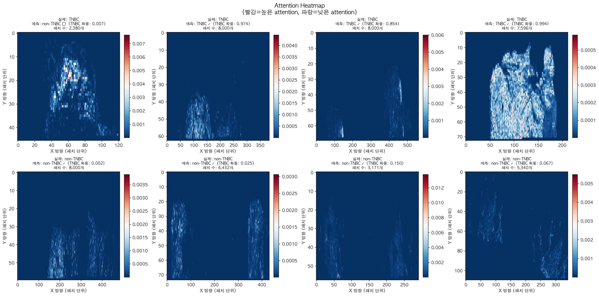
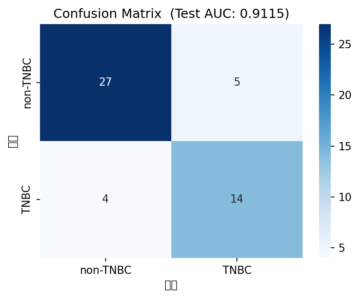
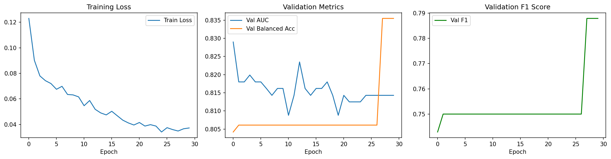
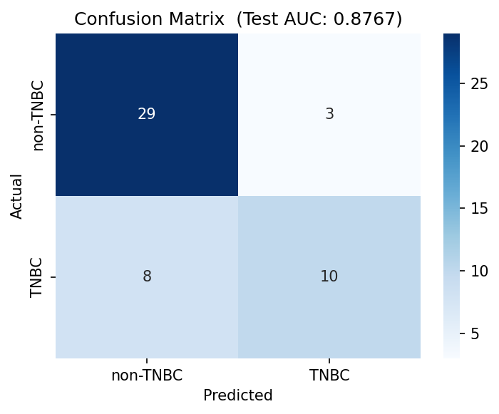
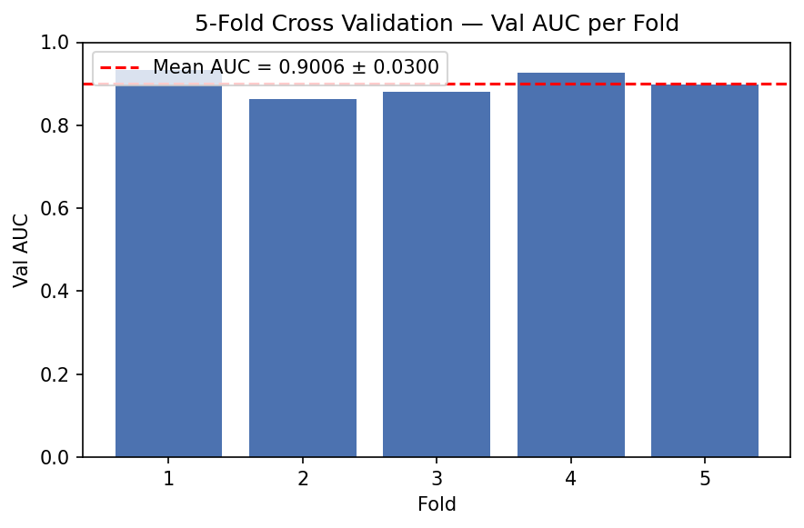

# TNBC Classification from H&E Whole-Slide Images (UNI + CLAM)

A portfolio project that classifies triple-negative breast cancer (TNBC) vs. non-TNBC directly from H&E-stained whole-slide images (WSIs), using a pathology foundation model for patch-level feature extraction and weakly-supervised multiple instance learning (MIL) for slide-level classification.

**Test AUC: 0.9115** (CLAM-SB, T4 GPU)

This repository is built on top of the official [CLAM](https://github.com/mahmoodlab/CLAM) implementation (Lu et al., *Nature Biomedical Engineering*, 2021) and is distributed under the same GPL-3.0 license (see `LICENSE.md`). The original CLAM codebase (`models/`, `wsi_core/`, `main.py`, `create_patches_fp.py`, etc.) is unmodified; this project's original contributions are the two notebooks under `1_feature_extraction/` and `2_classification/`.


---

## Pipeline

```
[Data collection]        [Feature extraction]        [Classification]        [Evaluation]
─────────────────        ────────────────────        ─────────────────       ────────────
TCGA-BRCA WSI      →     UNI (ViT-L/16)         →     CLAM-SB           →    Test AUC
(GDC, open access)       patch embeddings              Gated Attention         0.9115
                         (n_patches × 1024)             MIL

cBioPortal         →     saved as .pt files
ER/PR/HER2 labels
```

---

## Data

| Item | Detail |
|---|---|
| WSI source | GDC Portal, TCGA-BRCA, open access (no controlled-access token required) |
| Label source | cBioPortal API — ER / PR / HER2 status |
| TNBC definition | ER-negative + PR-negative + HER2-negative |
| Final cohort | 116 TNBC + 214 non-TNBC = **330 patients** |
| Sampling | Stratified random sampling on ER/PR/HER2 combination (`random_state=42`) |

All data used is from TCGA-BRCA's open-access tier (no protected health information / controlled-access genomic data).

---

## 1. Feature extraction — `1_feature_extraction/TNBCslide_usingUNImodel.ipynb`

The reported results were produced on a cloud T4 GPU. The notebook runs as a plain local Jupyter notebook — see "Running this project" below.

| Item | Detail |
|---|---|
| Model | [UNI](https://huggingface.co/MahmoodLab/UNI) (MahmoodLab, ViT-L/16 + DINOv2, pretrained on Mass-100K: 100K+ WSIs across 20 organ types) |
| Patch size | 256×256 px |
| Tissue filter | mean pixel value < 230, std > 10 (discard background) |
| Patch budget | dynamically computed per slide from its pixel dimensions (hard cap: 8,000 patches) |
| Extraction | streaming — 32 patches embedded at a time to keep memory usage fixed (~50MB), avoiding OOM on large SVS files (1–2GB) |
| Output | one `.pt` file per slide: `features` (n_patches × 1024), `coords`, `label`, `slide_size` |
| Result | 330 `.pt` files, avg. 5,577 patches/slide, avg. slide size 95,044 × 45,112 px |

## 2. Classification — `2_classification/CLAMLearning.ipynb`

The reported results were produced on a cloud T4 GPU and, separately, on a local Apple Silicon (MPS) machine for comparison. This notebook runs locally with Jupyter.

| Item | Detail |
|---|---|
| Model | CLAM-SB (single-branch, gated-attention MIL) |
| Data split | Train 231 / Val 49 / Test 50 (70:15:15, stratified, `random_state=42`) |
| Loss | Weighted cross-entropy (TNBC class weight ≈ 1.84) + instance-level auxiliary loss |
| Instance loss | Pseudo-labels auto-generated from attention-ranked top-k / bottom-k patches |
| Hyperparameters | LR = 2e-4, weight decay = 1e-5, bag loss weight = 0.7, 30 epochs |
| Scheduler | CosineAnnealingLR (T4 GPU run) / ReduceLROnPlateau (local run) |
| Cross-validation | Optional 5-fold stratified CV over the full 330-patient cohort, reusing the same model/training code (see cell 8 in the notebook) |

---

## Results

| Metric | T4 GPU (best) | Local (Apple M-series, MPS) |
|---|---|---|
| Test AUC | **0.9115** | 0.8767 |
| Balanced Accuracy | 0.8108 | 0.7309 |
| F1 Score | 0.7568 | 0.6452 |
| Best Val AUC | — | 0.8456 |

The gap between the two runs is attributable to CUDA vs. MPS RNG differences and split variance on a relatively small cohort (n=330; local test set n=50, 18 TNBC / 32 non-TNBC).

### Attention heatmaps



- TNBC slides: attention concentrates on specific regions, consistent with dense tumor cell areas.
- non-TNBC slides: attention is more diffusely spread across the slide.
- Of 4 example TNBC slides, 3 were correctly classified (predicted TNBC probability 0.854–0.994); 1 was misclassified (0.007).





### 5-fold cross-validation

Stratified 5-fold CV over the full 330-patient cohort, reusing the same model/training code as the main run (`2_classification/CLAMLearning.ipynb`, cell 8).

| Fold | Val AUC | Val Balanced Acc. | Val F1 |
|---|---|---|---|
| 1 | 0.9335 | 0.8899 | 0.8571 |
| 2 | 0.8625 | 0.8231 | 0.7727 |
| 3 | 0.8817 | 0.7376 | 0.6486 |
| 4 | 0.9272 | 0.8751 | 0.8235 |
| 5 | 0.8979 | 0.6608 | 0.5143 |
| **Mean ± SD** | **0.9006 ± 0.0300** | 0.7973 ± 0.0968 | 0.7232 ± 0.1411 |



AUC is stable across folds (0.86–0.93). Balanced accuracy and F1 vary more (fold 5 in particular), suggesting the fold-to-fold split has some effect on the decision threshold at this cohort size (n=330).

---

## Key technical decisions

| Decision | Rationale |
|---|---|
| GDC open-access tier | No access token needed; 3,112 slides available under this tier |
| Streaming feature extraction | Avoids OOM when processing large (1–2GB) SVS files |
| Dynamic per-slide patch budget | Keeps tissue coverage proportional across slides of very different sizes |
| Stratified sampling (`random_state=42`) | Mitigates class imbalance and guarantees a reproducible cohort across sessions |
| Weighted cross-entropy | Corrects for TNBC (116) vs. non-TNBC (214) class imbalance |
| Instance-level auxiliary loss | Core CLAM mechanism — generates patch-level supervision from slide-level labels only |
| `batch_size=1` | Required since patch count varies per slide |
| AUC + Balanced Accuracy | More reliable than raw accuracy under class imbalance |

---

## References

| Component | Paper |
|---|---|
| CLAM | Lu, M.Y. et al. "Data-efficient and weakly supervised computational pathology on whole-slide images." *Nature Biomedical Engineering*, 2021. |
| UNI | Chen, R.J. et al. "Towards a general-purpose foundation model for computational pathology." *Nature Medicine*, 2024. |
| Attention-based MIL | Ilse, M. et al. "Attention-based Deep Multiple Instance Learning." *ICML*, 2018. |

---

## Environment

| Stage | Environment |
|---|---|
| Feature extraction (reported results) | Cloud, T4 GPU |
| Classification (best reported result) | Cloud, T4 GPU |
| Classification (local comparison run) | Apple M-series MacBook, MPS backend, macOS |
| Notebooks in this repo | Local Jupyter (Python 3.10, Miniforge, conda env `clam`) |

---

## Connection to my Master's research

```
Master's research (transcriptomics)
  GDSC cell lines → patient-level transfer learning (TRANSACT)
  ssGSEA pathway vectors → multi-output SVR
  → predicts TNBC NAC response (pCR / RD)
  → +23pp specificity vs. baseline
          ↓ extending into pathology imaging
This project (WSI-based)
  TCGA-BRCA WSI → UNI feature extraction
  Patch embeddings → CLAM gated-attention MIL
  → TNBC vs. non-TNBC classification
  → Test AUC 0.9115
```

---

## Status

| Item | Status |
|---|---|
| UNI feature extraction (330 patients) | ✅ Done |
| CLAM training (T4 GPU, AUC 0.9115) | ✅ Done |
| CLAM training (local, AUC 0.8767) | ✅ Done |
| Attention heatmap visualization | ✅ Done |
| 5-fold cross-validation | ✅ Done (mean AUC 0.9006 ± 0.0300 across 5 folds) |

---

## Running this project

1. Clone this repo and install dependencies per the upstream CLAM instructions (`env.yml`, `docs/INSTALLATION.md`), plus each notebook's own setup cell (`openslide-python`, `timm`, `huggingface_hub`, etc.). Install the OpenSlide system package first — `brew install openslide` (macOS) or `sudo apt-get install -y openslide-tools libgl1` (Ubuntu).
2. Run `1_feature_extraction/TNBCslide_usingUNImodel.ipynb` locally with Jupyter, from inside this repo. When prompted for a Hugging Face token (required for `MahmoodLab/UNI` — request access [here](https://huggingface.co/MahmoodLab/UNI)), either set the `HF_TOKEN` environment variable beforehand, or enter it interactively when prompted; it is never written to the notebook file.
3. Feature files and logs are written under `~/TCGA_BRCA_project` by default. Override this with the `TNBC_PROJECT_ROOT` environment variable (and `TNBC_WORK_DIR` for the temporary slide-download directory) to use a different location.
4. Run `2_classification/CLAMLearning.ipynb` on the `.pt` feature files produced in steps 2–3.

**Do not commit a Hugging Face token or any other credential to this repository.**

---

## License

This repository is a derivative of [mahmoodlab/CLAM](https://github.com/mahmoodlab/CLAM) and is distributed under the GNU General Public License v3.0 — see `LICENSE.md`.
